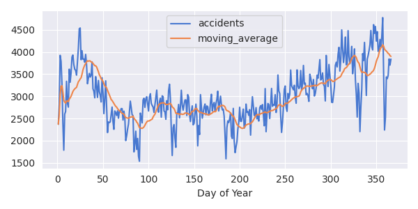

# US Accidents

An interviewer asked me 'What kind of exposure to SQL have you had?'
and I felt that my answer of 'one uni subject and some hacker-rank' 
practice problems' was insufficient. This project will demonstrate
- Database administration (creating a database, creating users with
appropriate permissions, integrity constraints); 
- ETL pipeline for larger than memory datasets;
- Geospatial analysis and visualisation.

Tools used include *PostgreSQL*, *Python (Polars)*, *Apache Sedona*.

See [this blog post](https://hlud6646.surge.sh/posts/sql_project/) for a fuller exploration.

## ETL.py
This script creates the cities and accidents tables in the database.
It is intended to be a minimal ETL pipeline, containing the following steps:

- Read an environment variables to establish a database connection;
- Create a polars data frame from a file;
- Manipulate and select columns;
- Write to db;
- Create some data integrity constraints in the db;
- Clean up.

## EDA.ipynb
This notebook contains some exploratory data analysis on the accidents data. 
The easiest way to run it is to spin up the official Apache Sedona docker instance
as described [here](https://hlud6646.surge.sh/posts/sql_project/). 

## References
- Moosavi, Sobhan, Mohammad Hossein Samavatian, Srinivasan Parthasarathy, and Rajiv Ramnath. “A Countrywide Traffic Accident Dataset.”, arXiv preprint arXiv:1906.05409 (2019).
- Moosavi, Sobhan, Mohammad Hossein Samavatian, Srinivasan Parthasarathy, Radu Teodorescu, and Rajiv Ramnath. “Accident Risk Prediction based on Heterogeneous Sparse Data: New Dataset and Insights.” In proceedings of the 27th ACM SIGSPATIAL International Conference on Advances in Geographic Information Systems, ACM, 2019.